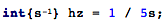
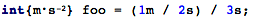
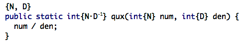
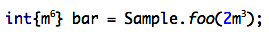
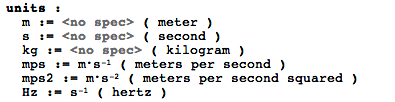

Physical Units
================

This is an example language implementing the idea of having physical units associated with the numeric values to reflect the value dimension. Typing rules prevent from assigning a variable a value of _wrong_ type, that is a type having mismatched unit annotation.

You can watch a [demo][4] of using this language (thanks to Vaclav Pech who created it).

Installing
----------

*UPDATE 12.12.2014*: the master branch has been migrated to [MPS 3.2 EAP 3][3] and is no longer compatible with version 3.1. Use the revision tagged `v0.2-mps31` to open with MPS 3.1. 

*UPDATE 7.5.2014*: the master branch has been migrated to [MPS 3.1 EAP 2][3] and is no longer compatible with version 3.0. Use the revision tagged `v0.1-mps30` to open with MPS 3.0. 

The project is made with [JetBrains MPS][1]. Download latest version of MPS [here][2]

After cloning the repository, open the project with MPS and run a full rebuild.

In order to run tests, set the path variable `mps.example.physunits.home` to point to the checkout directory.

Using
-----

The language `mps.example.physunits` extends baselanguage. In order to start using it just import this language into your model. 

Unit annotations
----------------

A primitive type can be annotated with unit specification. The unit annotated type is a subtype of the original primitive type, which it keeps as a child element. A numeric expression can also be annotated with a unit specification, which effectively alters its type to be unit annotated.

The annotated types can extend type safety promises of the typesystem, but have no effect on program execution, as they are erased at generation time.

Typechecking
------------

Type checking of arithmetic operations in presence of types annotated with units is augmented according to the following rules. 

- Addition and subtraction is allowed between types with same unit specifications or between unannotated types. Other combinations are forbidden. 

- Multiplication and division is allowed between any types, the annotated types are transformed according to usual rules. 

Examples: 

Polymorphic typechecking
------------------------

There is a limited support of polymorphism when checking method invocations. The method declaration must be annotated with meta physical unit declaration. 

Given an annotated method declaration, its return type can be inferred from the types of arguments. 

Limitations of typechecking
---------------------------

This implementation assumes the order of unit components must be the same for two types to be comparable for subtyping. This can be improved in the future. 

Internal representation
-----------------------

Internally unit specifications are kept as a list of references to unit declarations with associated exponents. 

Unit declarations
-----------------

The units are declared within a special model root. The unit may be declared either as a basic one or have a unit specification of its own. These are the same unit specification that are used to annotate types and expressions.

License
=======

Copyright 2014 JetBrains s.r.o

Licensed under the Apache License, Version 2.0 (the "License"); you may not use this file except in compliance with the License. You may obtain a copy of the License at

    http://www.apache.org/licenses/LICENSE-2.0

Unless required by applicable law or agreed to in writing, software distributed under the License is distributed on an "AS IS" BASIS, WITHOUT WARRANTIES OR CONDITIONS OF ANY KIND, either express or implied.  See the License for the specific language governing permissions and limitations under the License.  

> Written with [StackEdit](https://stackedit.io/).

  [1]: http://www.jetbrains.com/mps/
  [2]: http://www.jetbrains.com/mps/download/index.html
  [3]: http://confluence.jetbrains.com/display/MPS/JetBrains+MPS+EAP+Download+Page
  [4]: http://youtu.be/ARbb9FiG-RY
